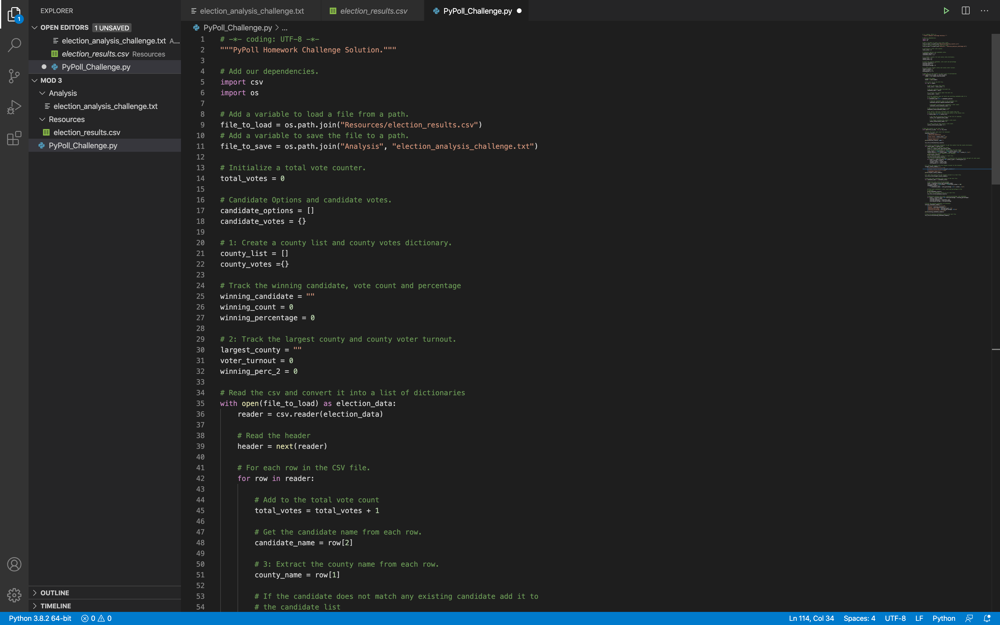

# election-analysis

## Project Overview
A Colorado Board of Elections employee has given you the following tasks to complete the election audit of a recent congressional election.

1. Calculate the total number of votes cast
2. Get a complete list of candidates who received votes
3. Calculate the total number of votes each candidate received
4. Calculate the percentage of votes each candidate won
5. Determine the winner of the election based on popular vote
6. Get a complete list of counties participating in the election
7. Calculate the votes from each county as well as their percentage
8. Determine which county had the largest voter turnout

## Resources
- Data Source: election_results.cscv
- Software: Python 3.7.6, Visual Studio Code 1.46.1

## Summary
The analysis of the election show that:
- There were 369,711 votes cast in the election
-County voter turnouts were:
  - Jefferson had 10.5% of the voter turnout with 38,855 votes
  - Denver had 82.8% of the voter turnout with 306,055 votes
  - Arapahoe had 6.7% of the voter turnout with 24,801 votes
- The county with the largest voter turnout was:
  - Denver
- The candidates were:
  - Charles Casper Stockham 
  - Diana DeGette
  - Raymon Anthony Doane
- The candidate results were:
  - Charles Casper Stockham received 23.0% of the vote and 85,213 of the votes
  - Diana DeGette received 73.8% of the vote and 272,892 of the votes
  - Raymon Anthony Doane received 3.1% of the vote and 11,606 of the votes
- The winner of the election was:
  - Diana Degette, who received 73.8% of the vote and 272,892 of the votes
  
## Audit Summary
This election audit script was designed to be a simple way to tabulate votes to be broken down by virtually any demographic contained within any election data file. If this script were to be used for later elections, there are a couple of important pieces of code that may need to be changed in order to work with a new file. Luckily, they're both close to the beginning of the script (pictured below).

The first is the path to the data file `file_to_load = os.path.join("Resources/election_results.csv")` and the path to your analysis text `file_to_save = os.path.join("Analysis", "election_analysis_challenge.txt")`. All you need to be sure of is that you have the correct file path from your original data file and to a folder where your data will be sent.

The other is the row and collumn index for each peice of data. Not all data files will be formatted the same way. For example, in this .csv the candidate name is in the 3rd row (`candidate_name = row[2]`). It will be important to look over future data sheets before they are inputed into this code to ensure that you are referencing the appropriate information.

